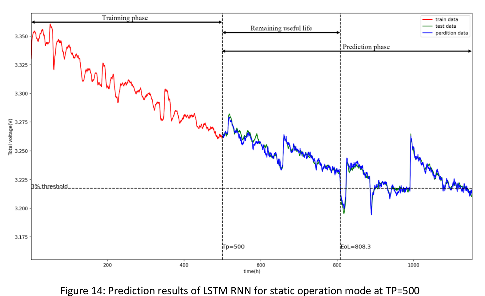
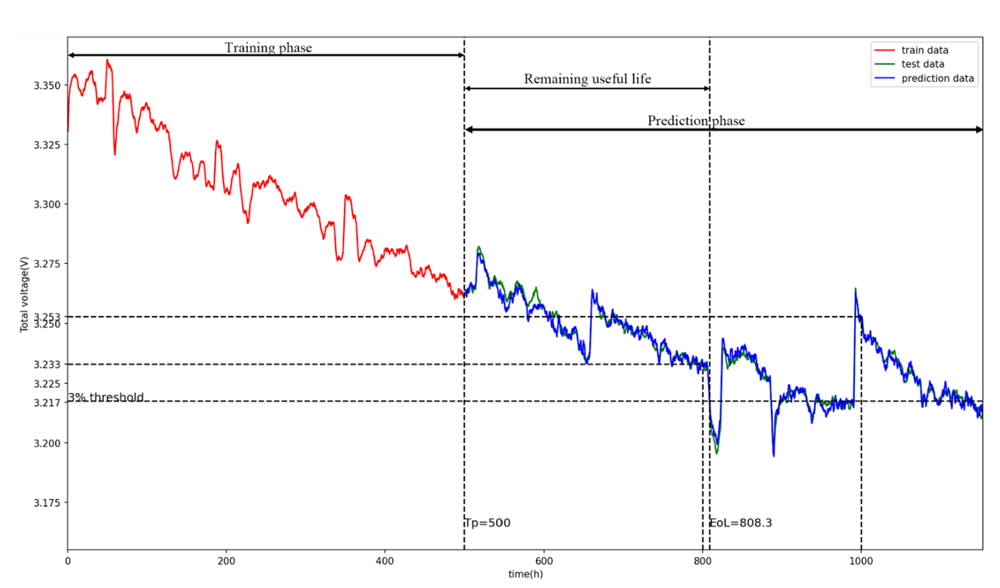
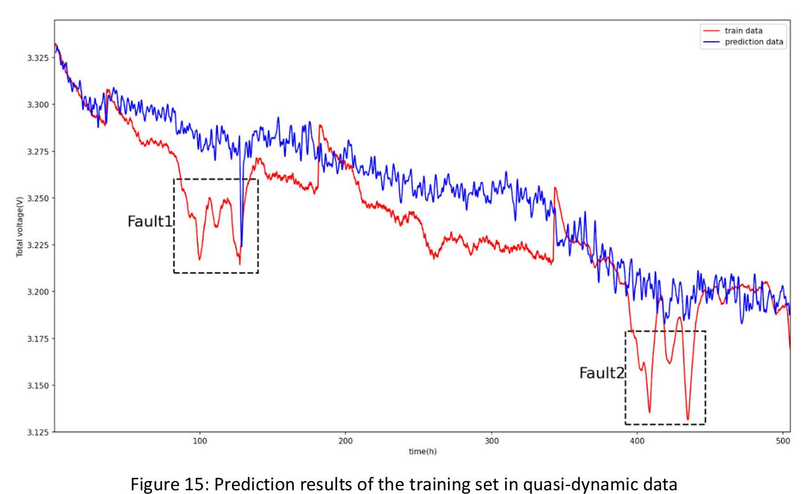
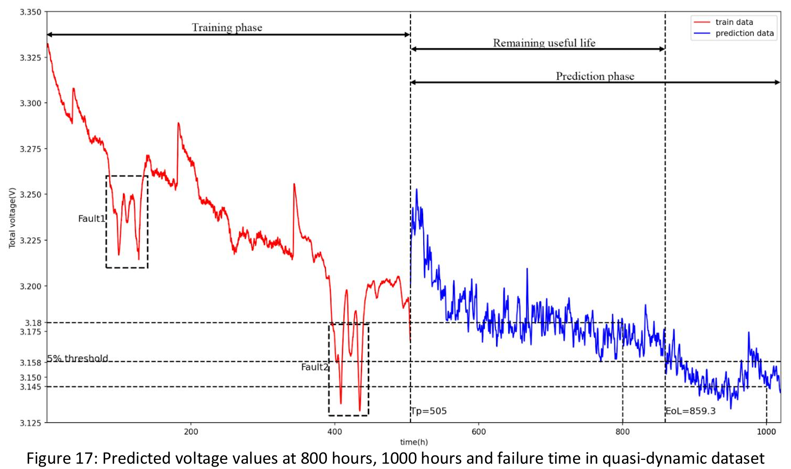

# Industrial-Training-Program--Real-Useful-Life-of-a-Hydrogen-Fuel-Cell
This repository contains the implementation, results, and report for the project **"Lifecycle Management of Renewable Energy Storage System"** focused on predicting the Remaining Useful Life (RUL) of Proton Exchange Membrane Fuel Cells (PEMFCs) using LSTM and other machine learning algorithms.

---

## 📌 Project Overview

Proton Exchange Membrane Fuel Cells (PEMFCs) offer a clean energy solution but suffer from degradation over time. This project applies data-driven models, especially Long Short-Term Memory (LSTM) networks, to predict the degradation and estimate RUL from static and quasi-dynamic operational datasets.

---

## 🎯 Objectives

- Process and clean fuel cell datasets using condensation and filtering
- Extract relevant features via PCA and correlation analysis
- Predict stack voltage using Linear Regression, SVM, ANN, and LSTM
- Estimate RUL using predicted degradation trends
- Compare performance across models using key evaluation metrics

---

## 🛠️ Technical Stack

- **Programming:** Python
- **Libraries:** NumPy, Pandas, Matplotlib, Scikit-learn, TensorFlow/Keras
- **ML Models:** LSTM, ANN, Support Vector Machine, Linear Regression
- **Preprocessing:** Moving Average Filter, PCA, Correlation Analysis

---

## 📊 Results Summary

### Static Operation

- **LSTM Prediction vs Actual Voltage**

    
  *Prediction results of LSTM RNN for static operation mode at TP = 500*

- **Failure Voltage Detection**

    
  *Predicted voltage values at 800 hours, 1000 hours and failure time in Static dataset*

---

### Quasi-Dynamic Operation

- **LSTM Prediction vs Actual Voltage**

    
  *Prediction results of the training set in quasi-dynamic data*

- **Failure Voltage Detection**

    
  *Predicted voltage values at 800 hours, 1000 hours and failure time in quasi-dynamic dataset*

---

## 📐 Evaluation Metrics

The model's performance was assessed using multiple evaluation metrics:

| Mode              | Model  | RMSE    | MAPE   | MAE    | R²     | % Error in Failure Time |
|-------------------|--------|---------|--------|--------|--------|--------------------------|
| Static            | LSTM   | 0.00248 | —      | —      | 0.98   | 0.0972%                  |
| Static            | ANN    | ~0.0048 | —      | —      | ~0.96  | —                        |
| Static            | SVM    | Higher  | —      | —      | Lower  | —                        |
| Static            | Linear | Higher  | —      | —      | Lower  | —                        |
| Quasi-Dynamic     | LSTM   | 0.0753  | —      | 0.02   | 0.80   | —                        |
| Quasi-Dynamic     | ANN    | —       | —      | —      | Negative                 | — |
| Quasi-Dynamic     | SVM    | —       | —      | —      | Negative                 | — |
| Quasi-Dynamic     | Linear | Lower RMSE but poor fit | — | — | ~0.773 | — |

> 📌 *Note: Some metrics (e.g., MAPE, MAE) are not explicitly reported for all models in the original report.*

---

## 📁 Repository Structure

```
renewable-energy-lstm/
├── README.md
├── reports/
│   └── Final_Report_1-42.pdf
├── results/
│   ├── static_voltage_prediction.png
│   ├── static_voltage_failure_detection.png
│   ├── quasi_dynamic_voltage_prediction.png
│   └── quasi_dynamic_voltage_failure_detection.png
├── models/  ← (optional for storing trained weights)
└── [your notebooks or code here]
```

---

## 📚 Report

The detailed technical report is available here:  
[`reports/Final_Report_1-42.pdf`](reports/Final_Report_1-42.pdf)

---

## 📌 Citation

If you use or reference this project, please cite the final report and the original authorship.
